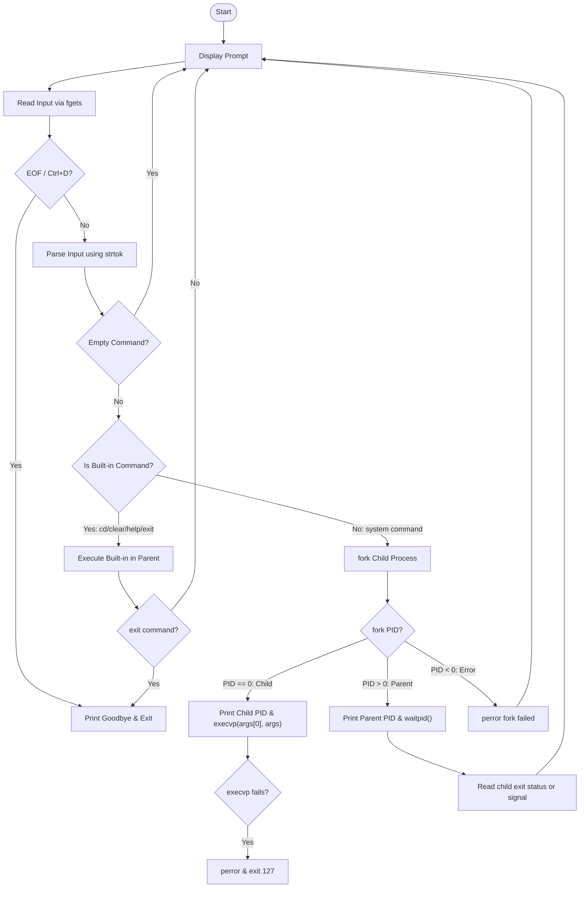

# OSSP Mini-Interactive Shell (Practical-2)

A modular, readable, and robust interactive command-line shell written in C for the Operating Systems and Systems Programming (OSSP) laboratory. It compiles cleanly on Linux using GCC under strict warning flags and implements key systems programming and OS process management concepts.

---

## Technical Architecture & Concepts

This project demonstrates the core abstractions of a modern operating system's shell:
1. **Interactive Command Loop**: Keeps the shell active and ready to accept successive commands.
2. **Terminal Input Processing**: Uses standard library `fgets` to read lines from stdin, which relies on the OS terminal line discipline (canonical mode) to handle echoing, keyboard inputs, and backspace deletion natively.
3. **Command Parsing & Tokenization**: Uses `strtok()` to split space/tab-delimited inputs into executable command strings (`char *args[]`).
4. **Built-in Command Interception**: Identifies commands that must run in the parent process context (like `cd` to change directories, `exit` to stop the shell loop, `clear` to clear screens, and `help`).
5. **Process Creation (`fork()`)**: Duplicates the calling process to create a child process.
6. **Program Execution (`execvp()`)**: Replaces the child process's memory space and register state with a new executable binary image.
7. **Parent-Child Synchronization (`waitpid()`)**: Blocks the parent shell until the child process completes execution, then retrieves its exit status.
8. **Robust Error Handling**: Checks return values of crucial systems APIs (`fork`, `chdir`, `waitpid`, and `execvp`), using `perror()` to output precise OS-level error details if failure occurs.

---

## Control Flow Diagram

The diagram below details the program execution path, process boundaries, and state transitions of the shell:



---

## Project Structure

```
Practical-2/
├── Makefile             # Strict compiler flags: -Wall -Wextra -Werror -pedantic
├── README.md            # Technical documentation and guides
├── include/
│   └── shell.h          # Global constants and function declarations
└── src/
    ├── main.c           # Shell interactive main loop and entrypoint
    └── shell.c          # Implementations of shell prompts, parsing, built-ins, & execution
```

---

## Build and Run Instructions

Make sure you are in a Linux-compatible environment (or WSL/Ubuntu on Windows).

### 1. Compile the Shell
Build the executable by running the Makefile:
```bash
make
```
This compiles the source code into a binary named `minishell` without warning flags under `-std=c99`.

### 2. Run the Shell
Execute the compiled binary:
```bash
./minishell
```

### 3. Cleaning Up
Remove built object files and the final executable:
```bash
make clean
```

---

## Viva Verification Checklist

Here is how you can verify each Practical-2 objective during your viva:

| Objective / Feature | Verification Action inside Mini Shell | Expected Output / Visual Indicator |
| :--- | :--- | :--- |
| **Interactive Prompt** | Launch the shell | Custom prompt `[username@hostname cwd]$ ` displays |
| **Backspace Handling** | Type random characters, then press **Backspace** | Characters are successfully erased on screen |
| **Empty Input** | Press **Enter** on an empty line | Prompt displays again without crash or fork |
| ** cd Built-in** | Type `cd ..` followed by `pwd` | Verifies directory changes in the parent process |
| ** help Built-in** | Type `help` | Prints the interactive shell manual |
| ** clear Built-in** | Type `clear` | Screen clears cleanly |
| **External Command** | Run `ls -la` or `uname -a` | Child PID is printed, command executes, and parent waits |
| **Exit Status** | Run `ls` followed by `nonexistent_cmd` | `ls` reports exit status `0`. Invalid command prints error with exit code `127` |
| **Ctrl+D / EOF** | Press `Ctrl+D` at the prompt | Prints `Goodbye!` and exits the shell cleanly |
| **exit Command** | Type `exit` | Exits the shell cleanly |
